# SafeDrive Guardian : Enhancing Driver Safety Through Context Aware Computing

## Overview

The project aims to significantly improve road safety by using various mobile sensors to address a few critical aspects of driving like speed limitation in severe weather or close to public areas.

## Prerequisites

* Android Studio
* Java Development Kit (JDK)
* Google Maps API Key - Enable Places API (for the submission there is one ke alredy added so can skip this step.)

## How to excute

* Build the Gradle
* Accept installation on needed libraries
* Run the application from Android Studio on emulator or physical device (SDK > 21)
## Navigating Thorught the Application!

1. User need to sign up if not the account already doesn't exist. 
   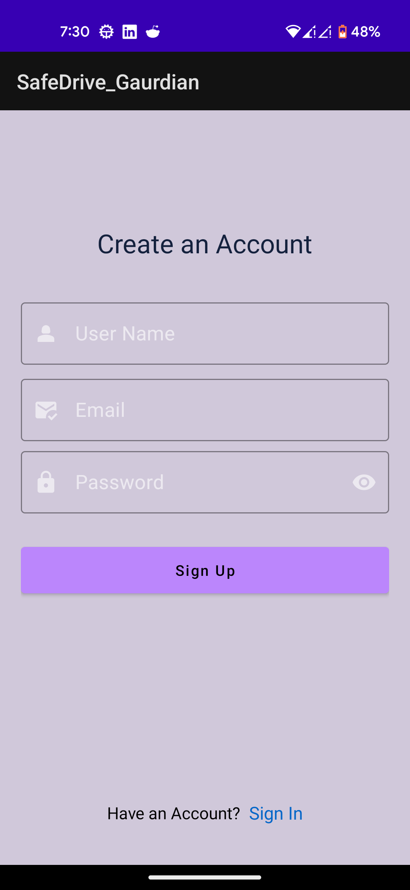 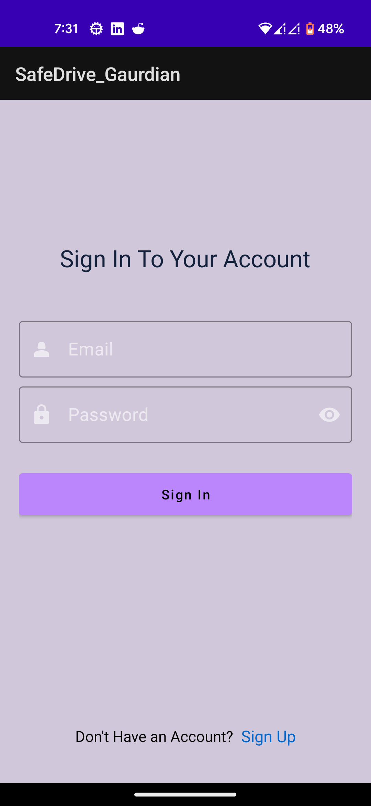

2. Dashboard will show the statistic of the last drive. 
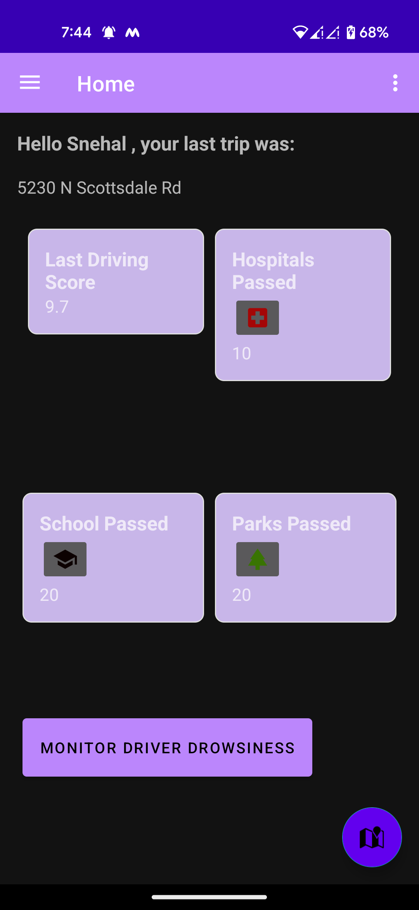

3. User can monitor the facial features whil driving using the "Monitor Driver Drowsiness" on dashboard. Based on yawning, blinking "Drowsy" attribute will be true if the user is sleeping for 10 secs.
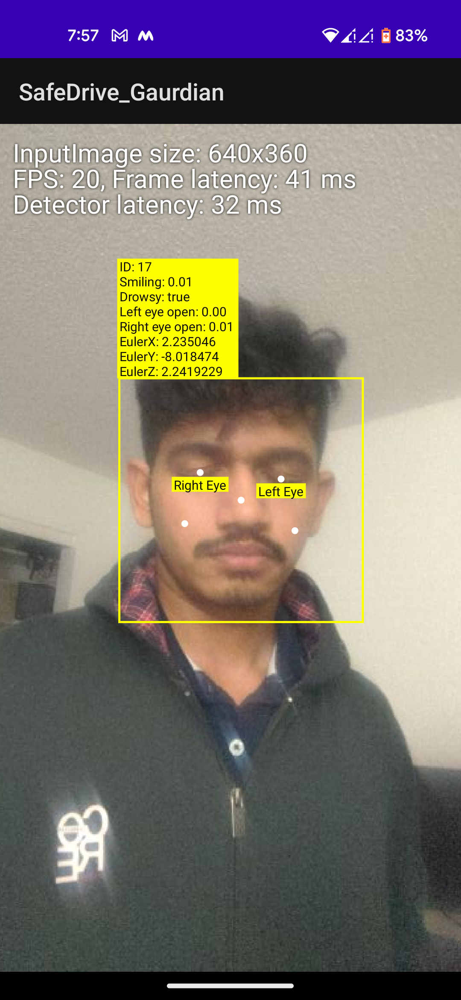

4. Other feature is to monitor driving pattern, choose the option "Driving pattern prediction". This will show nearby public places like hospital, parks and public places in radius of 1 km. ( school - Blue , hospital - Violet and park - Yellow). Marker circle radius - 350m.
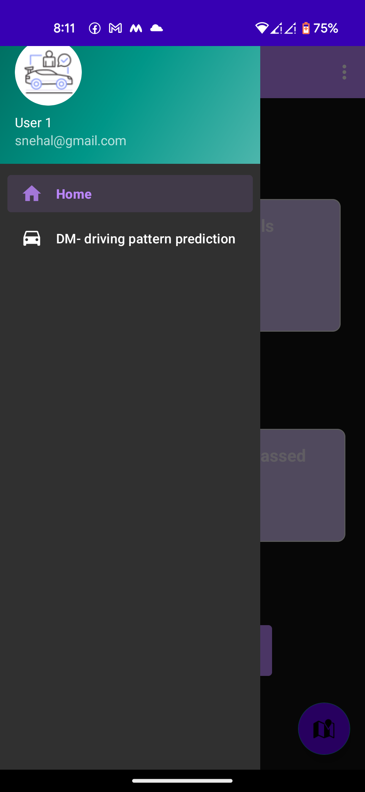 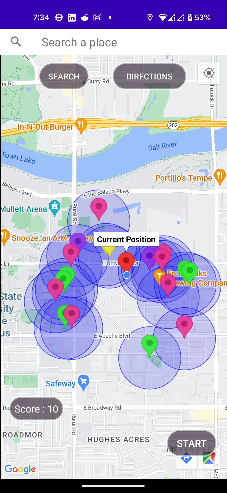 

5. To start the drive, first search for the destination place in top bar. The to get the address on map click on "Search" button. To find the safe route to the destination, click on "Directions" button. Blue will indicate the ruote suggested by google routes and green path is one avoidding crime hotspot.
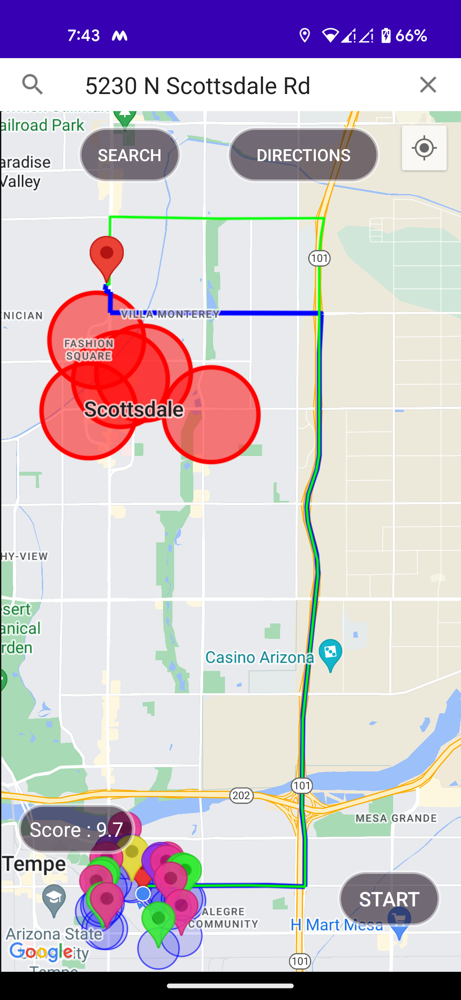

6. To start the trip click on "START" button, and now user can monitor the speed and driving pattern. To end the trip, click on "END". This will end the trip and give driving score out of 10.
To start anaother trip click on "Back" button.
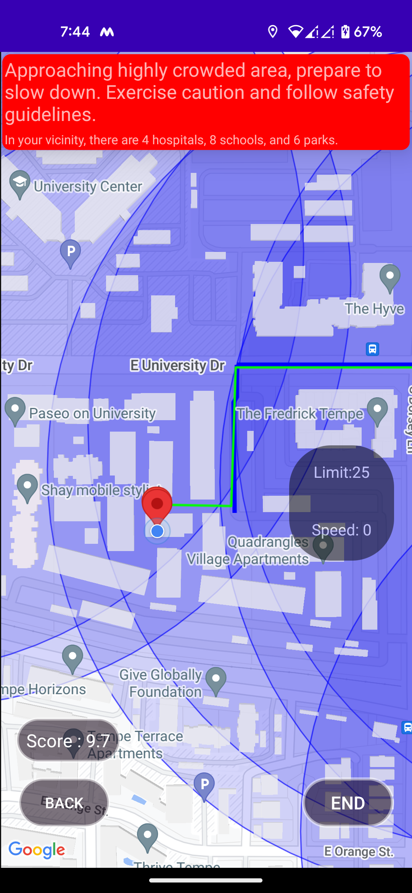  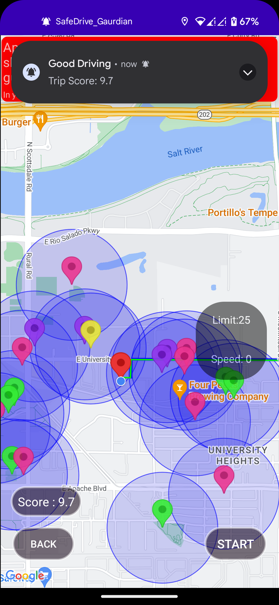

7. Apart from main features, user preferenses can be update from the settings menu.
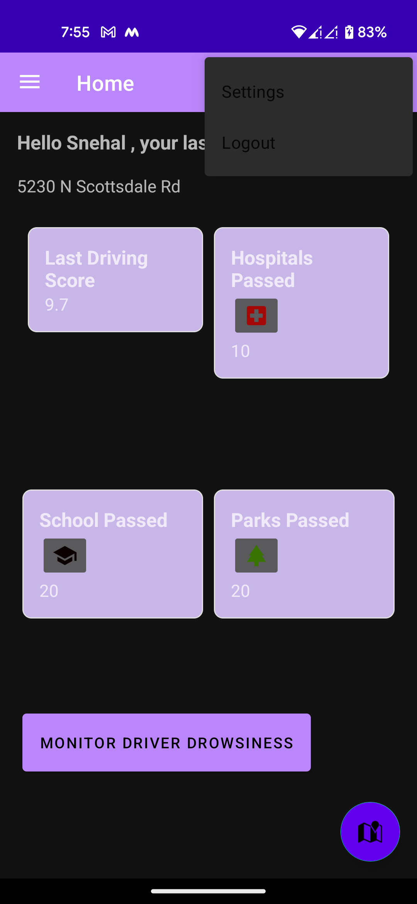 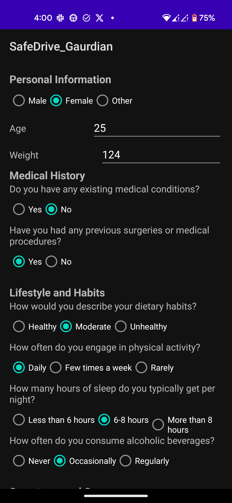

## Notes:

* For better usibility use the block address than tha name while searching for the place
* Make sure the internet connection is on and location permissions are granted.
* To add user preferences, go to setting from top right bar and make changes.
* Realtime Firebase database configurations:
 