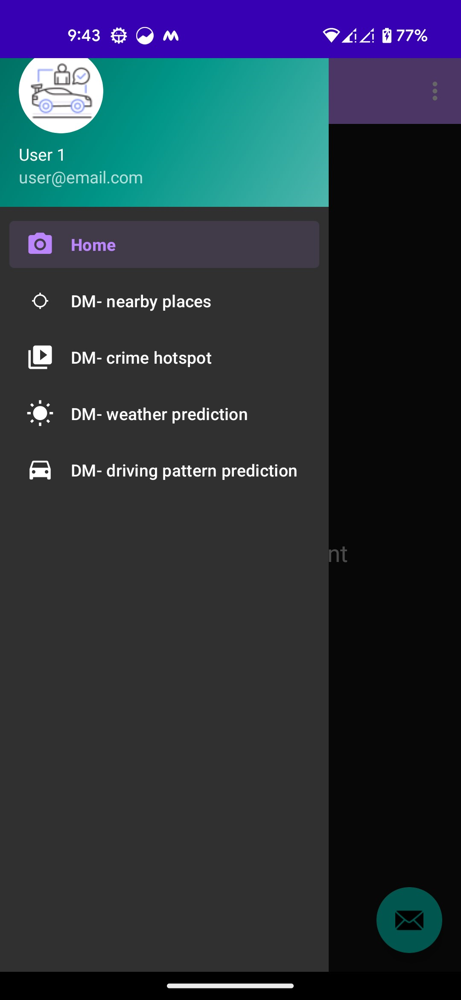
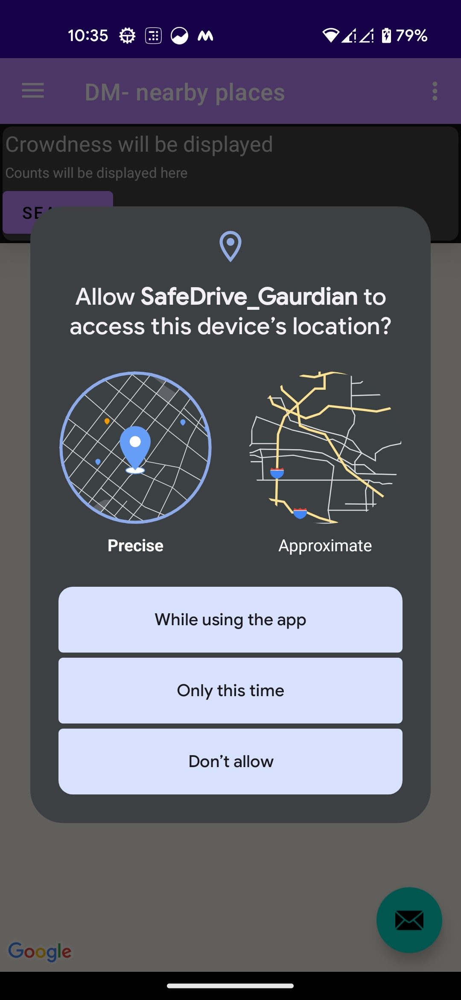
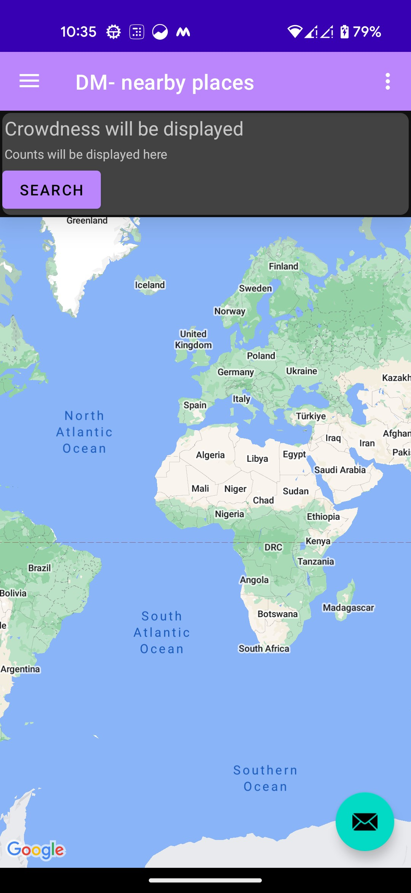
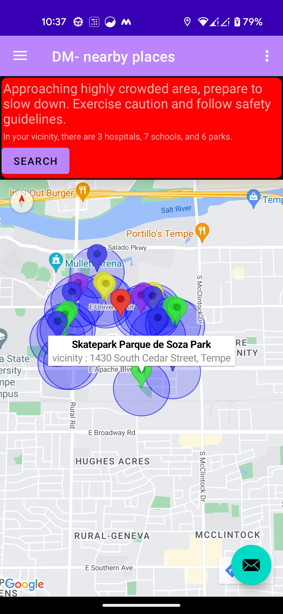
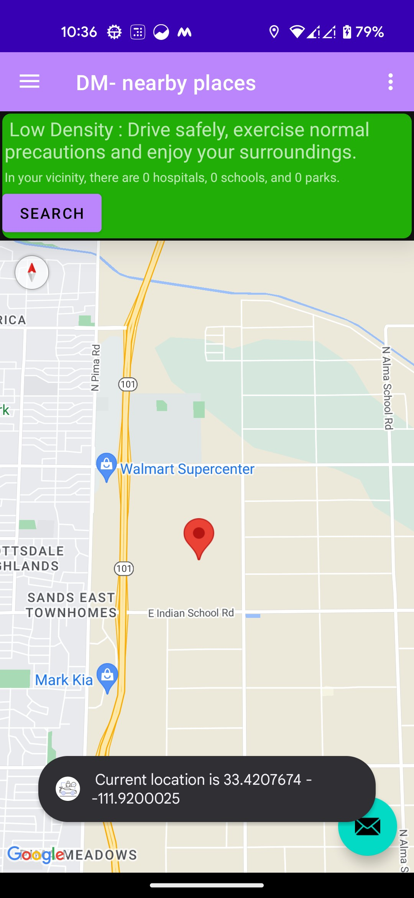

# SafeDrive Guardian : Enhancing Driver Safety Through Context Aware Computing

## Overview

The project aims to significantly improve road safety by using various mobile sensors to address a few critical aspects of driving like speed limitation in severe weather or close to public areas.

## Prerequisites

* Android Studio
* Java Development Kit (JDK)
* Google Maps API Key - Enable Places API (for the submission there is one ke alredy added so can skip this step.)

## How to excute

* Build the Gradle
* Accept installation on needed libraries
* Run the application from Android Studio

## Navigating Thorught the Application!
1. First from the navigation drawer select "DM -nearby Plces option"

2. Grant location permission![Alt text]

3. Click on srech button on first run to find neraby places to your curren location. 

3. App will show the school, hospital and park in 1 k radius. ( school - Blue , hospital - Violet and park - Yellow). Marker circle radius - 350m.

4. For individual testing purpose, I have also added an feature on mapClick(). On clicking at any other locationon map it will show the nearby public places in 1km radius.  

5. This feature will be integrated with live diving mode in Guardian angel so, the is a toast message popping up every 1 minutes, this is how we will get current co-ordinate and if previous position and current tis more than search radius (i.e 1km)/ 2 then again fetch the nearby places.
